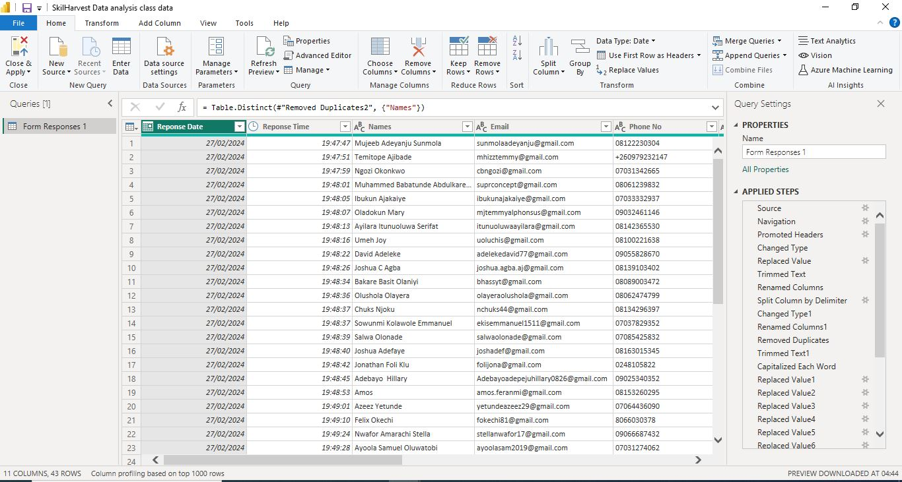

# 
 CLASS DATA ANALYSIS 

# 

## 
 Introduction 

This data analysis project focuses on the participants of the SkilHarvest Data Analysis Bootcamp. The project delves into the demographic and educational backgrounds of the bootcamp attendees, aiming to uncover insights that can enhance the understanding of the student profile and optimize the learning experience.
## 
 Aims and objectives 

- To analyze the demographic composition of the bootcamp participants, including age, occupation, marital status, and nationality.
- To explore the educational backgrounds of the students, focusing on their highest level of education attained.
- To identify any patterns or correlations within the dataset that can provide insights into the diversity and preferences of the bootcamp attendees.
- To utilize Power BI as the primary tool for data visualization and analysis, enabling interactive exploration of the dataset.
## 
 Problem statement 

Despite the increasing popularity of data analysis bootcamps, there remains a need to better understand the characteristics and backgrounds of the participants to tailor educational programs effectively. This project aims to address this gap by analyzing the demographic and educational data of SkilHarvest Data Analysis Bootcamp attendees, seeking to identify trends and patterns that can inform future program development and enhance the learning experience for all participants.
## 
 Data sourcing 

The data utilized for this project was gathered through Google Forms, a versatile survey tool, which was distributed among the attendees of the SkilHarvest Data Analysis Bootcamp.
## 
 Data transformation and cleaning 

1. Updated the "Timestamp" column data type from "TIMESTAMP" to "DATESTAMP" for improved consistency.
2. Trimmed leading & trailing spaces from the "Occupation" and "Country" columns to correct for inconsistencies.
3. Capitalized each word in the "Occupation"column to normalize values like "insuranceadvisor" and "student".
4. Replaced specific occupation values such as "Teaching" and "Education Officer 2" with a more generic term, "Tutor".
5. Replaced "Nysc" with "Corper" for consistency.
6. Standardized all engineering occupations variations by replacing with "Engineer".
7. Removed duplicate records.
# 

## 
 Data visualization 

Power BI was employed as the primary tool for visualizing and analyzing the collected data from the SkilHarvest Data Analysis Bootcamp participants. Power BI, a robust business intelligence platform developed by Microsoft, offered an extensive suite of features that facilitated the exploration and interpretation of the dataset.
