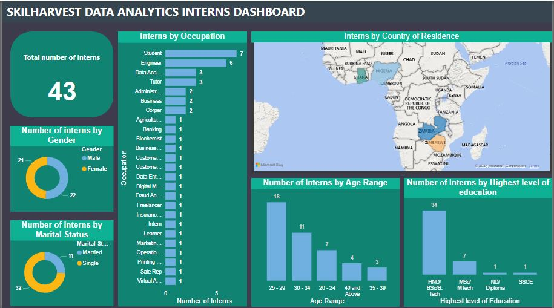

# 
 SKILHARVEST DATA ANALYSIS INTERNS 

# 

## 
 Introduction 

This data analysis project focuses on the participants of the SkilHarvest Data Analysis Bootcamp. The project delves into the demographic and educational backgrounds of the bootcamp attendees, aiming to uncover insights that can enhance the understanding of the student profile and optimize the learning experience.
## 
 Aims and objectives 

- To analyze the demographic composition of the bootcamp participants, including age, occupation, marital status, and nationality.
- To explore the educational backgrounds of the students, focusing on their highest level of education attained.
- To identify any patterns or correlations within the dataset that can provide insights into the diversity and preferences of the bootcamp attendees.
- To utilize Power BI as the primary tool for data visualization and analysis, enabling interactive exploration of the dataset.
## 
 Problem statement 

Despite the increasing popularity of data analysis bootcamps, there remains a need to better understand the characteristics and backgrounds of the participants to tailor educational programs effectively. This project aims to address this gap by analyzing the demographic and educational data of SkilHarvest Data Analysis Bootcamp attendees, seeking to identify trends and patterns that can inform future program development and enhance the learning experience for all participants.
## 
 Data sourcing 

The data utilized for this project was gathered through Google Forms, a versatile survey tool, which was distributed among the attendees of the SkilHarvest Data Analysis Bootcamp.
## 
 Data transformation and cleaning 

1. Updated the "Timestamp" column data type from "TIMESTAMP" to "DATESTAMP" for improved consistency.
2. Trimmed leading & trailing spaces from the "Occupation" and "Country" columns to correct for inconsistencies.
3. Capitalized each word in the "Occupation"column to normalize values like "insuranceadvisor" and "student".
4. Replaced specific occupation values such as "Teaching" and "Education Officer 2" with a more generic term, "Tutor".
5. Replaced "Nysc" with "Corper" for consistency.
6. Standardized all engineering occupations variations by replacing with "Engineer".
7. Removed duplicate records.
# 

## 
 Data visualization 

Power BI was employed as the primary tool for visualizing and analyzing the collected data from the SkilHarvest Data Analysis Bootcamp participants. Power BI, a robust business intelligence platform developed by Microsoft, offered an extensive suite of features that facilitated the exploration and interpretation of the dataset.
# 

## 
 Data presentation 

To present my analysis, I have created a video using Loom, a screen recording and video messaging tool to provide a comprehensive overview of the analysis findings of my data. You can view the video presentation [here](https://www.loom.com/share/dff37c091eef4b13877a32c17570f07e?sid=59a5e5b6-576f-4810-b570-5d3e57f56c04)
## 
 Insights from analysis 

- Among the 43 participants in the SkilHarvest Data Analytics Bootcamp, interns with SSCE & ND qualifications are underrepresented, comprising only 4.7% of the total cohort.
- Gender does not seem to play a significant role in determining the interest in learning data analytics, as the gender distribution among interns is fairly balanced.
- There is a notable interest in data analytics among students, engineers, teachers, and individuals with similar job roles to data analysts, collectively comprising 44.2% of the SkilHarvest Data Analytics Interns population.
- There is an observable relationship between upskilling interest, age group, and academic qualifications. Specifically, only 16.3% of interns have Msc and they are all within an average group of 30-40. Hence, the need to upskill reduces with increased age and academic qualifications.
- The analysis revealed a total of 43 attendees at the SkilHarvest Data Analysis Bootcamp. Among these attendees, the vast majority, comprising 40 individuals, representing approximately 93%, were from Nigeria, indicating a strong local representation. Furthermore, the remaining attendees included one participant each from Zimbabwe, Zambia, and Ghana, showcasing a modest yet noteworthy international presence within the bootcamp cohort.
## 
 Recommendations 

- Develop targeted outreach programs to engage interns with SSCE and ND qualifications, aiming to increase their participation in Data Analytics Bootcamp. This could involve tailored communication strategies and support mechanisms to address potential barriers to participation.
- Develop tailored training programs that cater to the specific needs and interests of different demographic groups, considering factors such as age, academic qualifications, and marital status. This approach can enhance engagement and maximize the effectiveness of the training initiative partnerships.
- Foster collaborative with educational institutions, professional organizations, and industry stakeholders to promote data analytics education and training opportunities. Engaging with these entities can facilitate access to a wider pool of potential participants and enhance program visibility.
- Diversify marketing channels and timing strategies to ensure broader reach and sustained engagement with the survey form. This may involve utilizing multiple communication platforms and optimizing timing to capture responses from a diverse range of interns.
- It is also recommended that the organizers of the SkilHarvest Data Analysis Bootcamp diversify future cohorts by actively recruiting participants from neighboring countries. This initiative will enhance diversity, foster regional collaboration, and provide networking opportunities beyond national borders.
## 
 Conclusion 

Through the utilization of Google Forms for data collection and Power BI for analysis and visualization, this project has provided valuable insights into the demographic and educational profiles of the attendees at the SkilHarvest Data Analysis Bootcamp. The findings of this analysis offer actionable insights for SkilHarvest Data Analysis Bootcamp organizers to enhance program offerings and optimize the learning experience for participants. By leveraging these insights, organizers can also continue to attract a diverse cohort of participants and ensure that the bootcamp remains relevant and impactful in the rapidly evolving field of data analysis.

